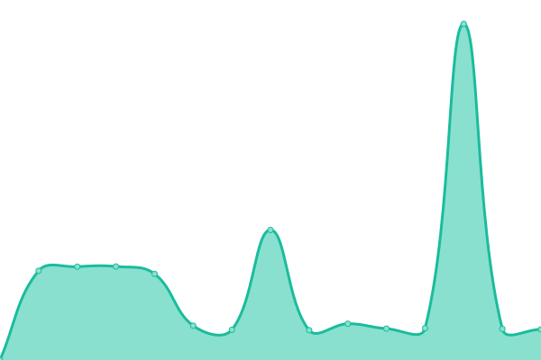

# [📈 Live Status](https://status.voiceintern.com): <!--live status--> **🟧 Partial outage**

This repository contains the open-source uptime monitor and status page for [Medblocks](https://medblocks.org/), powered by [Upptime](https://github.com/upptime/upptime).

With [Upptime](https://upptime.js.org), you can get your own unlimited and free uptime monitor and status page, powered entirely by a GitHub repository. We use [Issues](https://github.com/medblocks/upptime/issues) as incident reports, [Actions](https://github.com/medblocks/upptime/actions) as uptime monitors, and [Pages](https://status.voiceintern.com) for the status page.

<!--start: status pages-->
<!-- This summary is generated by Upptime (https://github.com/upptime/upptime) -->
<!-- Do not edit this manually, your changes will be overwritten -->
<!-- prettier-ignore -->
| URL | Status | History | Response Time | Uptime |
| --- | ------ | ------- | ------------- | ------ |
|  [argocd](https://argocd.argocd.voiceintern.com) | 🟩 Up | [argocd.yml](https://github.com/medblocks/upptime/commits/HEAD/history/argocd.yml) | 

 1055ms
     
 | 

<a href="https://status.voiceintern.com/history/argocd">99.76%</a>
    

|  [auth](https://auth.test4.voiceintern.com/.ory/kratos/health/alive) | 🟩 Up | [auth.yml](https://github.com/medblocks/upptime/commits/HEAD/history/auth.yml) | 

 1044ms
     
 | 

<a href="https://status.voiceintern.com/history/auth">99.54%</a>
    

|  [drx](https://drx.test4.voiceintern.com) | 🟩 Up | [drx.yml](https://github.com/medblocks/upptime/commits/HEAD/history/drx.yml) | 

 742ms
     
 | 

<a href="https://status.voiceintern.com/history/drx">100.00%</a>
    

|  [encounter](https://encounter.test4.voiceintern.com) | 🟩 Up | [encounter.yml](https://github.com/medblocks/upptime/commits/HEAD/history/encounter.yml) | 

 1057ms
     
 | 

<a href="https://status.voiceintern.com/history/encounter">99.76%</a>
    

|  [fhir](https://fhir.test4.voiceintern.com) | 🟥 Down | [fhir.yml](https://github.com/medblocks/upptime/commits/HEAD/history/fhir.yml) | 

 2178ms
     
 | 

<a href="https://status.voiceintern.com/history/fhir">100.00%</a>
    

|  [gphc](https://gphc.test4.voiceintern.com) | 🟩 Up | [gphc.yml](https://github.com/medblocks/upptime/commits/HEAD/history/gphc.yml) | 

 728ms
     
 | 

<a href="https://status.voiceintern.com/history/gphc">100.00%</a>
    

|  [kasturba](https://kasturba.test4.voiceintern.com) | 🟩 Up | [kasturba.yml](https://github.com/medblocks/upptime/commits/HEAD/history/kasturba.yml) | 

 769ms
     
 | 

<a href="https://status.voiceintern.com/history/kasturba">100.00%</a>
    

|  [keto-admin](https://keto-admin.test4.voiceintern.com/health/alive) | 🟥 Down | [keto-admin.yml](https://github.com/medblocks/upptime/commits/HEAD/history/keto-admin.yml) | 

 893ms
     
 | 

<a href="https://status.voiceintern.com/history/keto-admin">100.00%</a>
    

|  [keto-public](https://keto-public.test4.voiceintern.com/health/alive) | 🟥 Down | [keto-public.yml](https://github.com/medblocks/upptime/commits/HEAD/history/keto-public.yml) | 

 919ms
     
 | 

<a href="https://status.voiceintern.com/history/keto-public">100.00%</a>
    

|  [launchpad](https://launchpad.test4.voiceintern.com) | 🟩 Up | [launchpad.yml](https://github.com/medblocks/upptime/commits/HEAD/history/launchpad.yml) | 

 765ms
     
 | 

<a href="https://status.voiceintern.com/history/launchpad">100.00%</a>
    

|  [ndhm](https://ndhm.test4.voiceintern.com) | 🟩 Up | [ndhm.yml](https://github.com/medblocks/upptime/commits/HEAD/history/ndhm.yml) | 

 743ms
     
 | 

<a href="https://status.voiceintern.com/history/ndhm">100.00%</a>
    

|  [odoo](https://odoo.test4.voiceintern.com) | 🟩 Up | [odoo.yml](https://github.com/medblocks/upptime/commits/HEAD/history/odoo.yml) | 

 1509ms
     
 | 

<a href="https://status.voiceintern.com/history/odoo">100.00%</a>
    

|  [openehr](https://openehr.test4.voiceintern.com/ehrbase/rest/openehr/v1/definition/template/adl1.4) | 🟥 Down | [openehr.yml](https://github.com/medblocks/upptime/commits/HEAD/history/openehr.yml) | 

 1033ms
     
 | 

<a href="https://status.voiceintern.com/history/openehr">100.00%</a>
    

|  [snomed](https://snomed.test4.voiceintern.com/v1/snomed/search) | 🟩 Up | [snomed.yml](https://github.com/medblocks/upptime/commits/HEAD/history/snomed.yml) | 

 1109ms
     
 | 

<a href="https://status.voiceintern.com/history/snomed">100.00%</a>
    

|  [tester](https://tester.test4.voiceintern.com) | 🟩 Up | [tester.yml](https://github.com/medblocks/upptime/commits/HEAD/history/tester.yml) | 

 910ms
     
 | 

<a href="https://status.voiceintern.com/history/tester">100.00%</a>
    

<!--end: status pages-->

[**Visit our status website →**](https://status.voiceintern.com)

## 📄 License

- Powered by: [Upptime](https://github.com/upptime/upptime)
- Code: [MIT](./LICENSE) © [Medblocks](https://medblocks.org/)
- Data in the `./history` directory: [Open Database License](https://opendatacommons.org/licenses/odbl/1-0/)
